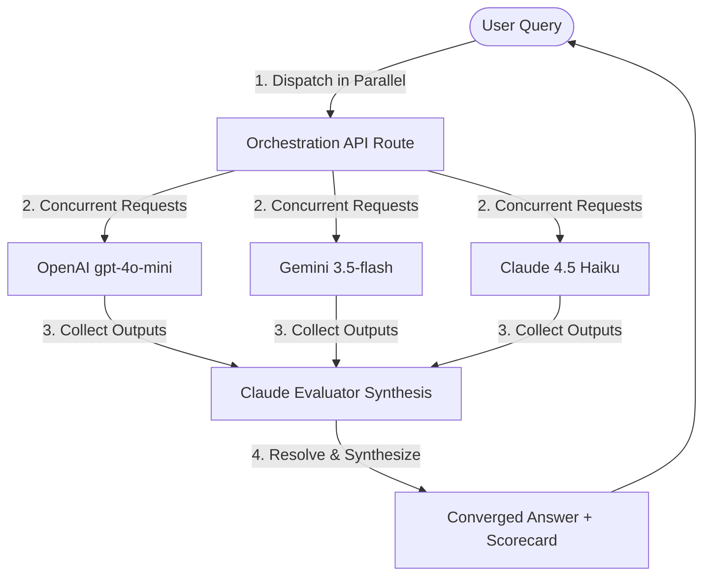

# ConsensuAI | Self-Consistency Answer Engine

A high-fidelity GenAI application that queries multiple independent language models in parallel, compares their outputs to identify consensus and discrepancies, and orchestrates a final evaluator model (Claude) to synthesize a single, authoritative converged answer.

## UI Design & Architecture
* **Layout:** Full-Screen three-column split-panel dashboard layout:
  * **Left Panel (260px):** Dynamic sidebar managing local chat history lists, rate limits, and 24-hour lock countdown timers.
  * **Middle Panel (Flex-1):** Primary chat conversation interface with a collapsible layout adjustment engine and floating input bar.
  * **Right Panel (380px/440px):** System workflow telemetry visualizations and project core concept cards.
* **Design Aesthetic:** Cyber-Lime Neobrutalist theme featuring solid outline borders (`border-2 border-slate-900`), hard offset shadows (`shadow-[4px_4px_0px_0px]`), raw pastel card fills, and responsive viewport sizing.
* **Dynamic Visualization:** Pinned interactive SVG workflow diagram animating hardware-accelerated data telemetry pulses traveling between models and convergence nodes in real-time.

---

## Key Features

### 1. Persistent Local Chat History
* Stores multiple distinct chat threads directly within browser `localStorage`.
* Supports starting fresh sessions with a **`+ New Chat`** button, hot-switching active chats, and deleting old threads.
* Automatically updates sidebar session titles based on the text of your first query.

### 2. Collapsible Layout Engine
* Features a collapse toggle button (`◀`) inside the sidebar header to hide the history panel and maximize focus space.
* Pins a floating expand tab (`▶`) to the left edge of the screen (`fixed left-4 top-4`) when collapsed to slide the panel back out.
* Automatically updates the middle chat layout offset padding (`lg:pl-20`) and centers the floating input bar dynamically when toggled.

### 3. 24-Hour Rate Limiter with Live Ticking Cooldown
* Restricts users to **2 queries per 24 hours** to manage API token usage.
* Records the initial Epoch timestamp of the first query block inside `localStorage` (`self_consistency_first_query_time`).
* Runs a live background tick checker, updating a ticking countdown clock (`HHh MMm SSs`) in the UI.
* Disables the sidebar reset button and input textareas once the cap is reached, displaying: `Reset locked (23h 59m 58s)`.
* Automatically clears the limit and restores full querying access when the 24-hour duration has passed.

### 4. High-Fidelity Loading UI & Telemetry
* Replaced simple text loading indicators with a custom Neobrutalist loader spinner featuring a rotating dual-ring design and a pulsing brain (`🧠`) icon.
* Features individual live-pulse status cards showing connections to **OpenAI (`gpt-4o-mini`)**, **Gemini (`gemini-3.5-flash`)**, and **Claude (`claude-4.5-haiku`)** during active dispatches.

### 5. Token Headroom & Truncation Prevention
* Increased maximum token limits (`maxTokens`) in the API routing layer to **`4096`** to provide ample token headroom for long synthesized responses.
* Prompt-level constraints force the evaluator to summarize responses in a concise, high-density format, avoiding verbose preambles or repetition.

### 6. Defensive Evaluator Fallback Wrapper
* Implements a try-catch fail-safe wrapper in [app/api/generate/route.js](file:///Users/sarthakgupta/Documents/GENAI/Projects/SelfConsistencyAnswerEngine%20/self-consistency-engine/app/api/generate/route.js).
* If the Claude evaluator step crashes (due to timeout or model outage), the backend automatically intercepts the error, routes the first successful model candidate's answer directly, and formats the scorecard to prevent request failure.

---

## How It Works

1. **User Prompt Input:** The user enters a question into the floating input bar.
2. **Parallel Dispatch:** The engine orchestrates parallel, independent calls to:
   * **OpenAI** (`gpt-4o-mini`)
   * **Google Gemini** (`gemini-3.5-flash`)
   * **Anthropic Claude** (`claude-haiku-4-5-20251001` - the most cost-efficient Claude model)
3. **Claude Evaluator Synthesis:** The engine collects all raw model answers and passes them to the Claude evaluator. Guided by a customized system prompt, Claude performs a self-consistency analysis:
   * Identifies points of agreement (indicators of high factual reliability).
   * Reconciles conflicts and resolves factual discrepancies.
   * Compiles a single, refined converged answer.
4. **Model Performance Scorecard:** Claude yields a qualitative confidence assessment indicating model contribution percentage weights and comparative reasoning, which the frontend interceptor parses into styled progress bars.

---

## Self-Consistency Flow & System Workflows

Self-consistency is an advanced prompt engineering technique. While it traditionally samples multiple reasoning paths from a single model to find the majority consensus, this engine adapts and scales this concept into a **cross-architecture self-consistency pipeline** across three independent model providers:



### Self-Consistency Logic & Resolution:
1. **Diverse Base Generation:** Querying three different model families (OpenAI GPT, Google Gemini, Anthropic Claude) ensures high perspective diversity, minimizing individual training bias and filtering out specific model hallucinations.
2. **Meta-Consensus Extraction:** The evaluator acts as a meta-consistency layer, analyzing:
   * **Consensus Points:** Factual agreements (e.g. historical events, exact dates, math equations, or code syntax) are extracted as high-confidence components.
   * **Discrepancy Resolution:** Conflicts (e.g. divergent claims or calculation errors) are scrutinized. The evaluator reasons about which provider's logic is most sound and discards outliers.
3. **Refined Synthesis:** Rather than copying a single response verbatim, the evaluator takes the strongest individual parts (e.g. OpenAI's clear style, Gemini's technical details, Claude's logical precision) and compiles a unified, superior answer.

---

## Proper Orchestration of API Calls

The orchestration layer is designed for speed, resilience, and multi-turn context preservation. It is implemented in [app/api/generate/route.js](file:///Users/sarthakgupta/Documents/GENAI/Projects/SelfConsistencyAnswerEngine%20/self-consistency-engine/app/api/generate/route.js) and [lib/providers.js](file:///Users/sarthakgupta/Documents/GENAI/Projects/SelfConsistencyAnswerEngine%20/self-consistency-engine/lib/providers.js):

### 1. Concurrent Parallel Execution
To optimize query latency, calls to OpenAI, Gemini, and Claude are executed concurrently using `Promise.allSettled`. This ensures the total round-trip time is determined by the slowest single model, rather than the sum of all three models.

### 2. Multi-Turn Context & Schema Role Mapping
The orchestration layer persists conversation thread history and maps it dynamically to each provider's unique structural API requirements:
* **OpenAI & Claude:** Format history turns into alternating `user` and `assistant` message schemas.
* **Google Gemini:** Requires alternating `user` and `model` role roles; standard `assistant` roles trigger API validation errors. The orchestration layer automatically reformats the keys before dispatch.
* **Evaluator Context Injection:** The preceding conversation history is prefixed to the evaluator prompt so that follow-up pronouns (e.g., *"How old is he?"*) resolve correctly against the historical context.

### 3. Graceful Degradation & Fail-Safe Mechanisms
* **Partial Failures:** If an API key is blocked, hits a rate limit (429), or faces service outage (503), the engine catches the exception. The failed provider's card displays the error, while the evaluator successfully runs using the remaining successful answers (requiring a minimum of 1 successful response).
* **Abort timeouts:** All API connections are wrapped in an `AbortController` timeout capped at 60 seconds (`TIMEOUT_MS = 60_000`). This protects the user from hung connections during API overloads.
* **Total Failure Fallback:** If all three models fail, the engine skips the evaluator and yields a direct 502 error banner to check API configurations. If the evaluator fails, the raw candidate responses are still shown.

---

## Technology Stack

* **Framework:** Next.js 14 (App Router)
* **API Handlers:** Native ES modules with Node fetch integrations (no external SDK wrappers to maintain lightweight execution)
* **Styling:** Tailwind CSS + Vanilla CSS custom animations
* **State Management:** React local thread state

---

## Running Locally

1. Install dependencies:
   ```bash
   npm install
   ```
2. Copy the example environment file:
   ```bash
   cp .env.example .env.local
   ```
3. Open `.env.local` and paste your API keys:
   ```env
   OPENAI_API_KEY=your-openai-key
   GEMINI_API_KEY=your-gemini-key
   ANTHROPIC_API_KEY=your-anthropic-key
   ```
4. Run the development server:
   ```bash
   npm run dev
   ```
5. Open `http://localhost:3000` (or `http://localhost:3001` if port 3000 is occupied) in your browser.
